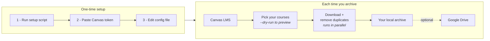

# Canvas Backup

Canvas Backup is a local-first Python tool for archiving Canvas LMS course shells to a folder on your computer. That folder can be a normal local folder, an external drive, or a folder that already syncs through Google Drive Desktop, Dropbox, or OneDrive.

It is designed for instructors who want to keep a reusable course library organized by:

```text
archive-root/
  year/
    semester/
      course-shell/
```

The tool preserves Canvas file folders, module order, module items, pages, assignments, quizzes, discussions, and due-date manifests.

After downloading, Canvas Backup checks downloaded Canvas files for exact duplicates, removes duplicate copies, and records the cleanup in `manifests/duplicates.json`. Built-in Google Drive API upload is optional.

## How It Works



The [Visual Guide](docs/visual-guide.md) walks through the same flow with the commands attached.

## Quick Start

Clone the repository:

```bash
git clone https://github.com/Ryfter/canvas-backup.git
cd canvas-backup
```

Run setup.

Windows PowerShell:

```powershell
.\scripts\setup.ps1
```

macOS/Linux:

```bash
chmod +x scripts/setup.sh
./scripts/setup.sh
```

The setup script creates `.venv`, `.env`, `config.local.toml`, `secrets/`, and the archive folder from your config if they do not already exist.

After setup, use the launcher in the project folder. You do not need to find or run anything inside `.venv`.

Edit `.env`:

```env
CANVAS_TOKEN=your-canvas-token
```

Edit `config.local.toml`:

```toml
[canvas]
base_url = "https://your-school.instructure.com"
token_env = "CANVAS_TOKEN"

[archive]
root = "~/CanvasArchive"
year = "2026"
semester = "Spring"
download_workers = 6
```

To store archives in a synced folder, change `root` to that local folder path, such as a Google Drive Desktop, Dropbox, or OneDrive folder.

Preview recent shells.

Windows PowerShell:

```powershell
.\canvas-backup.ps1 --config config.local.toml archive-recent --years 4 --choose --dry-run
```

macOS/Linux:

```bash
./canvas-backup.sh --config config.local.toml archive-recent --years 4 --choose --dry-run
```

Download selected shells by removing `--dry-run`. Add `--sync-drive` only if you want Canvas Backup to upload through the Google Drive API after the local download finishes.

## Documentation

**New here? Start with one of these.**

- [Visual Guide](docs/visual-guide.md) — the whole tool in two diagrams and four commands.
- [Professor Quick Start](docs/professor-quickstart.md) — the guided path, start to finish.
- [Setup Guide](docs/setup.md) — installing it, in detail.

**Everyday use**

- [Command Reference](docs/commands.md) — every command and flag.
- [Configuration](docs/configuration.md) — what goes in `config.local.toml`.
- [Troubleshooting](docs/troubleshooting.md) — when something goes wrong.
- [Updating Canvas Backup](docs/updating.md) — getting the latest version.

**Going further**

- [Technical Professor Guide](docs/technical-professor-guide.md) — performance, manifests, recovery.
- [Local And Synced Folder Backups](docs/local-and-synced-folders.md) — external drives, Dropbox, OneDrive.
- [Google Drive Setup](docs/google-drive.md) — the optional Drive API upload.
- [Archive Format](docs/archive-format.md) — exactly what lands on disk.
- [Security Notes](SECURITY.md) — protecting your Canvas token.

**Contributing and background**

- [Development](docs/development.md)
- [Project Design](docs/project-design.md)
- [How Canvas Backup Was Created With AI](docs/ai-build-workflow.md)
- [Prompt Playbook](docs/prompt-playbook.md)

## What Gets Downloaded

- Canvas course metadata.
- Canvas file folders and files.
- Exact duplicate downloaded files are removed after download and before Drive upload.
- Modules and module items in order.
- Pages as HTML plus JSON metadata.
- Assignments as HTML plus JSON metadata.
- Due dates as JSON and CSV.
- Quizzes and discussion topics as JSON, with discussion HTML where available.
- Download reports, duplicate cleanup reports, and optional Drive sync reports.

## Important Safety Notes

Never commit secrets. These files are intentionally ignored:

- `.env`
- `config.local.toml`
- `secrets/`
- `secrets/google-client-secret.json`
- `secrets/google-token.json`

Local archive folders are created automatically. Google Drive API sync creates Drive folders if that optional workflow is used.

## Current Limitations

- External tool content, publisher integrations, and embedded third-party media may only be preserved as links or metadata if Canvas does not expose the underlying file through the API.
- Canvas access depends on the permissions attached to your Canvas token.
- Built-in Google Drive API sync is optional. A local Google Drive Desktop, Dropbox, or OneDrive folder may be enough for many users.
