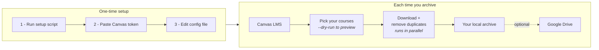

# Visual Guide

A picture of what Canvas Backup does and how you drive it. If you prefer words, read the
[Professor Quick Start](professor-quickstart.md) instead — this page covers the same ground.

## How It Works

Canvas Backup pulls a course out of Canvas, writes it to a folder on your computer, and
optionally copies that folder to Google Drive. The local folder is the real product. Everything
else is optional.



What lands on disk:

```text
archive-root/
  2026/
    Spring/
      ITM370/
        files/         Canvas files, in their original folders
        modules/       module order and items
        pages/         pages as HTML + JSON
        assignments/   assignments as HTML + JSON
        manifests/     due dates, download report, duplicate report
```

## Using It

Four commands cover almost everything.

| # | Goal | Command |
|---|------|---------|
| 1 | See your courses | `courses` |
| 2 | Preview before downloading | `archive-recent --years 4 --choose --dry-run` |
| 3 | Download them | `archive-recent --years 4 --choose` |
| 4 | Optional: push to Google Drive | `sync-drive --archive <folder>` |

Each one runs through the launcher for your platform:

```powershell
.\canvas-backup.ps1 --config config.local.toml archive-recent --years 4 --choose --dry-run
```

```bash
./canvas-backup.sh --config config.local.toml archive-recent --years 4 --choose --dry-run
```

### Handy flags

| Flag | What it does |
|------|--------------|
| `--dry-run` | Show what would download. Downloads nothing. |
| `--choose` | Pick from a numbered list instead of taking everything. |
| `--limit 2` | Do a small test run before committing to a big one. |
| `--download-workers 10` | Use more parallel downloads. Go faster. |
| `--json-progress` | Emit JSON Lines instead of text. For scripts, not people. `archive` only. |

Full detail in the [Command Reference](commands.md).

### Never share or commit these

- `.env`
- `config.local.toml`
- `secrets/`

They hold your Canvas token and Google credentials. They are already gitignored for you — see
[Security Notes](../SECURITY.md).

## Editable diagrams

The two diagrams above also exist as hand-drawn Excalidraw boards, which are easier to drop into
slides or a department handout:

- [How It Works](https://excalidraw.com/#json=wlHf0WkKUa55-x_97fH9V,Dnp-lshVMgWwRZv5gx3WSQ)
- [Using It](https://excalidraw.com/#json=yk52yeoXc6B6HPrW-3zEA,ibiacWzbtzD53ujrfhVo2Q)

Those links point at excalidraw.com. The source of truth is committed here, so the boards survive
even if the links stop resolving:

- `docs/diagrams/how-it-works.excalidraw`
- `docs/diagrams/using-it.excalidraw`

To edit one, open [excalidraw.com](https://excalidraw.com), choose **Open**, and pick the file.
